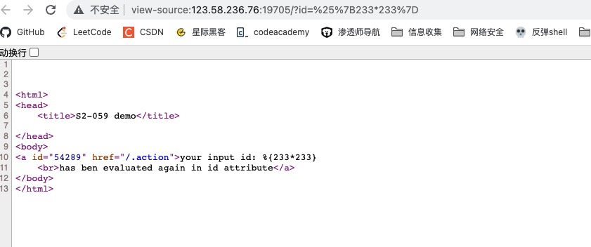

Struts2 远程代码执行（CVE-2020-17530）(s2-061)

有cve，直接github找利用脚本

https://github.com/YanMu2020/s2-062

参数为id 访问http://your-ip:8080/?id=%25%7B233*233%7D`

发现OGNL表达式被成功执行

S2-061是对S2-059沙盒的绕过。

使用脚本直接打

拿到flag