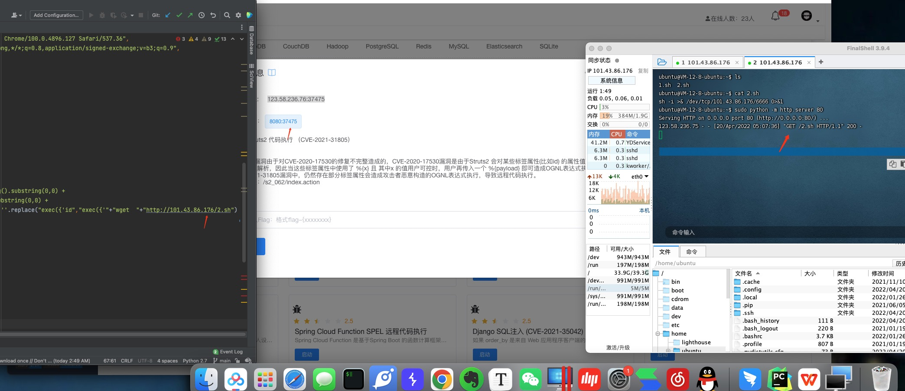
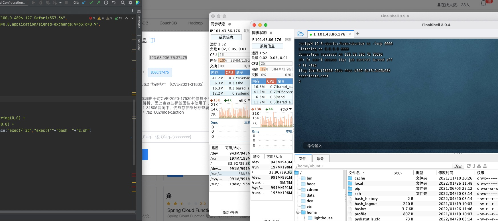

Struts2 远程代码执行（CVE-2021-31805）(s2-062)

有cve，直接github找利用脚本

https://github.com/YanMu2020/s2-062

vulfocus环境无回显，dnslog测试命令执行成功，存在漏洞。

直接修改payload反弹失败，于是攻击机开了一个http，写个反弹shell脚本，让靶机下载执行。

修改exp 执行2.sh

拿到shell

拿到flag。